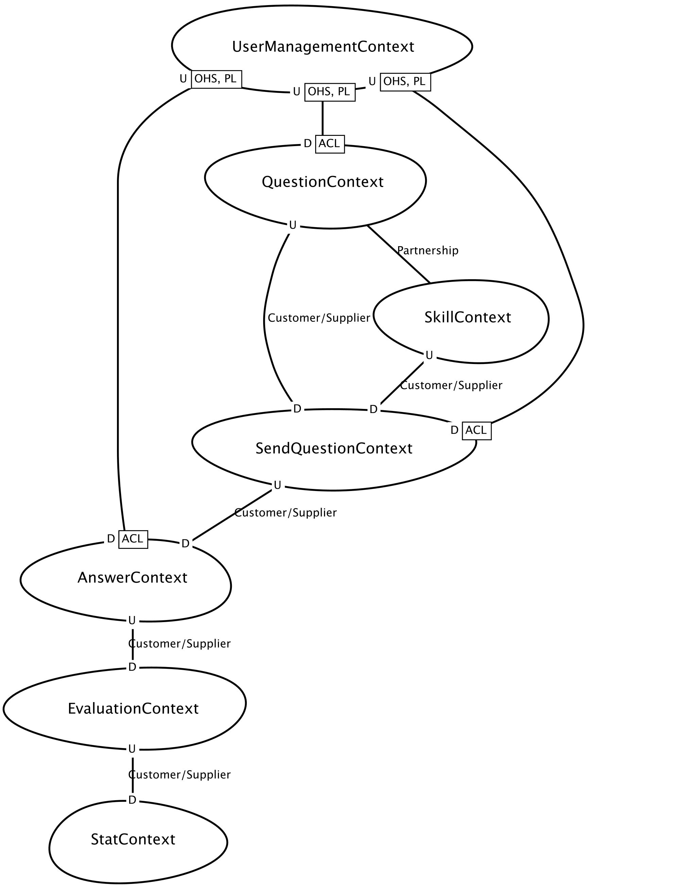

# Game dev DDD

Game dev DDD follow context mapper and sculptor DSL to define elements of the domains and command, event flows.

Generate :

- Check vs code requirements to enable context mapper plugin

Steps to generate jhipster domain langage microservices definition :
- Open `src/main/resources/freemarker-templates/ddd-microservices.ftl` 
- Do Right click on opened file and select `Generate Text File With Freemarker`
- Select `src/main/resources/freemarker-templates/ddd-microservices.ftl` as template
- Do `make build`

Stack :
- Spring boot located in `apps/`
- Deployment logic in `apps/docker-compose/`
- Postgres queue or kafka could be used to store events but for simplicity we use a simple event table at end of each flows.
- Authentication : basic login with jwt token on `UserManagementContext` at `/api/authenticate`

## Start Using Context Mapper Now
Run :

```bash
asdf install
gradle wrapper
./gradlew clean build
```

## Regenerate jhipster classes

```bash
make build
```

## Build an api client for an app

```bash
make <app>.client APP=<dest-app>
```

Example :

```bash
make SkillContext.client APP=QuestionContext
```

### Start spring services

```bash
make start
```

## View Databases

Each bounded context has same system, here example for user management :

Username : `UserManagementContext`
Url : ./apps/UserManagementContext/target/h2db/db/usermanagementcontext

## Open the Demo File
In the folder `src/main/cml` you find a small **[CML demo](./src/main/cml/demo.cml)** (DDD sample application) where you can start to familiarize yourself with our DSL and our tools.
You can find more info's about the tool and a complete documentation on our website [https://contextmapper.org/](https://contextmapper.org/).

### Context map



[**All Aggregates and event flows**](doc/diagrams.md)

### Dev

- Route for apis : `/v3/api-docs`

## Resources

- https://solocoding.dev/blog/eng_spring_entity_listener_SpringBoot_SpringDataJpa